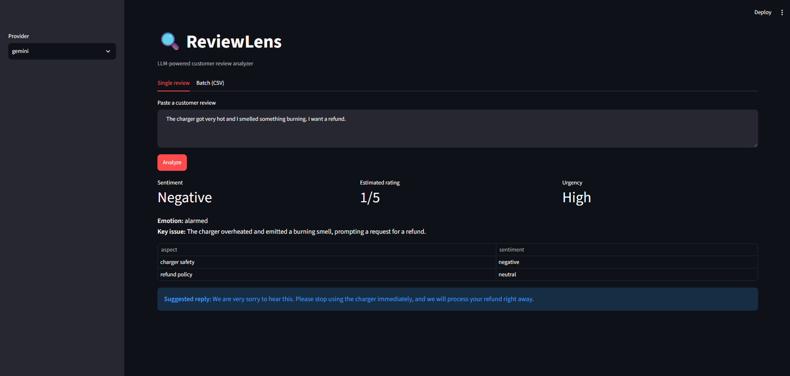
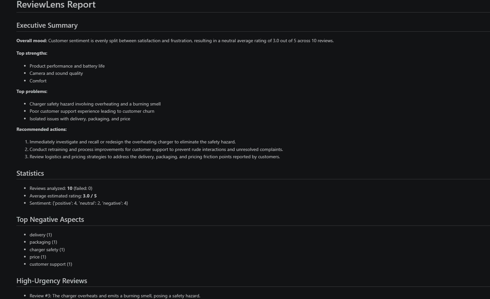
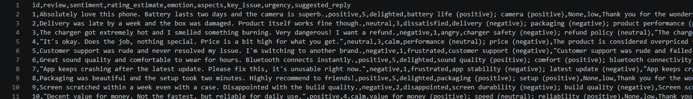

# 🔍 ReviewLens – LLM-Powered Customer Review Analyzer

An NLP project that uses an LLM (Google Gemini, via API) to turn raw customer reviews into structured insights:
sentiment, estimated rating, emotion, aspect-level sentiment, key issue, urgency, a suggested
company reply, and an executive summary for a product manager.

**Author:** Soumil Ahuja | **Reg. No:** 23FE10CDS00529 | **Section:** G | **GitHub:** soumilahuja

## How the LLM is used
1. **Per-review analysis** – each review is sent to the LLM with a few-shot prompt that forces a strict JSON schema.
2. **Validation & self-repair** – output is parsed and validated; if the JSON is malformed, the LLM is re-asked with a repair prompt.
3. **Executive summary** – aggregated statistics are sent back to the LLM, with a separate system prompt, to write a manager-ready summary.
4. **Reliability** – retries with exponential backoff, client-side rate limiting for the free tier, and failures recorded per review without crashing the batch.

## Project structure
```
├── main.py               # CLI entry point
├── app.py                # Streamlit demo UI
├── config.yaml           # Configuration file (provider, model, temperature, paths)
├── prompts/prompts.yaml  # Prompt file (system, analysis, repair, summary prompts)
├── src/
│   ├── llm_client.py     # Provider wrapper (Gemini / Anthropic / OpenAI) + retries + rate limiting
│   ├── analyzer.py       # Parsing, validation, batch processing, aggregation
│   ├── report.py         # JSON / CSV / Markdown output
│   └── pipeline.py       # Shared setup
├── data/sample_reviews.csv
├── tests/test_analyzer.py
├── .env.example          # API key template
└── requirements.txt
```

## Setup
```bash
git clone https://github.com/soumilahuja/MUJ-DS-23FE10CDS00529.git
cd MUJ-DS-23FE10CDS00529/code/reviewlens
python -m venv .venv
.venv\Scripts\activate            # Windows (Mac/Linux: source .venv/bin/activate)
pip install -r requirements.txt
```
Create a file named `.env` in this folder (copy `.env.example`) and add your free key from
https://aistudio.google.com/apikey :
```
GEMINI_API_KEY=your-key-here
```
The provider is set in `config.yaml` (`gemini`, `anthropic`, `openai`, or `mock` for offline tests).

## Run
```bash
python main.py                                  # uses data/sample_reviews.csv
python main.py --input my_reviews.csv --limit 5 # your own CSV (needs a 'review' column)
streamlit run app.py                            # web UI
python -m pytest                                # unit tests (use the offline mock LLM)
```
Outputs are written to `outputs/`: `results.json`, `results.csv`, `report.md`.

> **Note:** The Gemini free tier allows about 5 requests per minute, so the client waits
> ~13 seconds between calls. A full run on the 10 sample reviews takes about 2–3 minutes.

## Configuration (`config.yaml`)
| Key | Meaning |
|---|---|
| `provider` | `gemini`, `anthropic`, `openai` (or `mock` for offline tests) |
| `models` | model name per provider |
| `temperature` | 0.2 for consistent structured output |
| `max_tokens` | maximum length of each LLM reply |
| `max_retries` / `parse_retries` | API retries / JSON-repair retries |
| `max_workers` | parallel API calls (1 for the free tier) |

## Sample result
On the 10 sample reviews the model flagged the overheating charger as the top problem
(high urgency) and recommended retraining customer support. Full outputs from this run are in the results/ folder.

## Screenshots

**Web UI (Streamlit) – single review analysis**



**Generated report with executive summary**



**Per-review structured results (CSV)**

